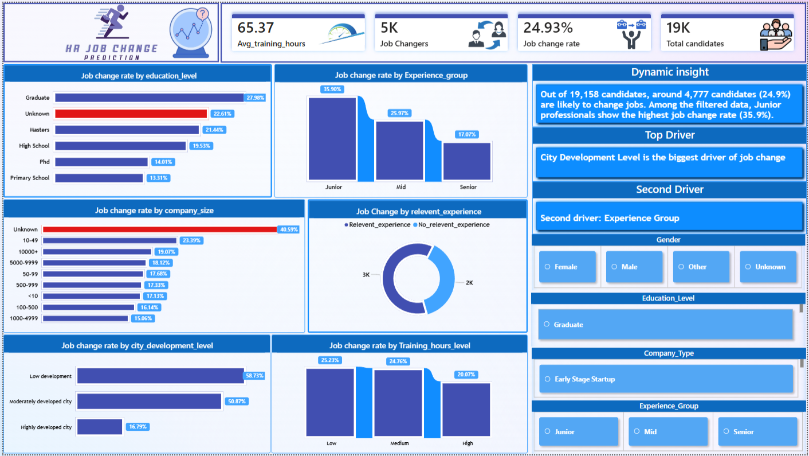

# HR Job Change Prediction Analytics

## Project Overview
This project analyzes factors influencing employee job change behavior using HR analytics.

The dashboard explores patterns in experience level, city development, company size, education, and training hours to identify key drivers of employee mobility.

## Tools Used
- SQL (MySQL) – Data Cleaning & EDA
- Power BI – Data Visualization & Dashboard
- DAX – Driver Analysis & Dynamic Insights

## Key Insights
- Junior professionals show the highest job change rate.
- Candidates in moderately developed cities exhibit higher mobility.
- Employees in smaller companies demonstrate higher job switching behavior.

## Dashboard Preview

## Features
- Interactive filters (Gender, Education_level, Company Type, Experience group)
- Dynamic insights generation
- Driver analysis (Top & Second driver detection)

## Dataset
Source: Kaggle HR Analytics Job Change Dataset [Dataset/aug_train.csv]
